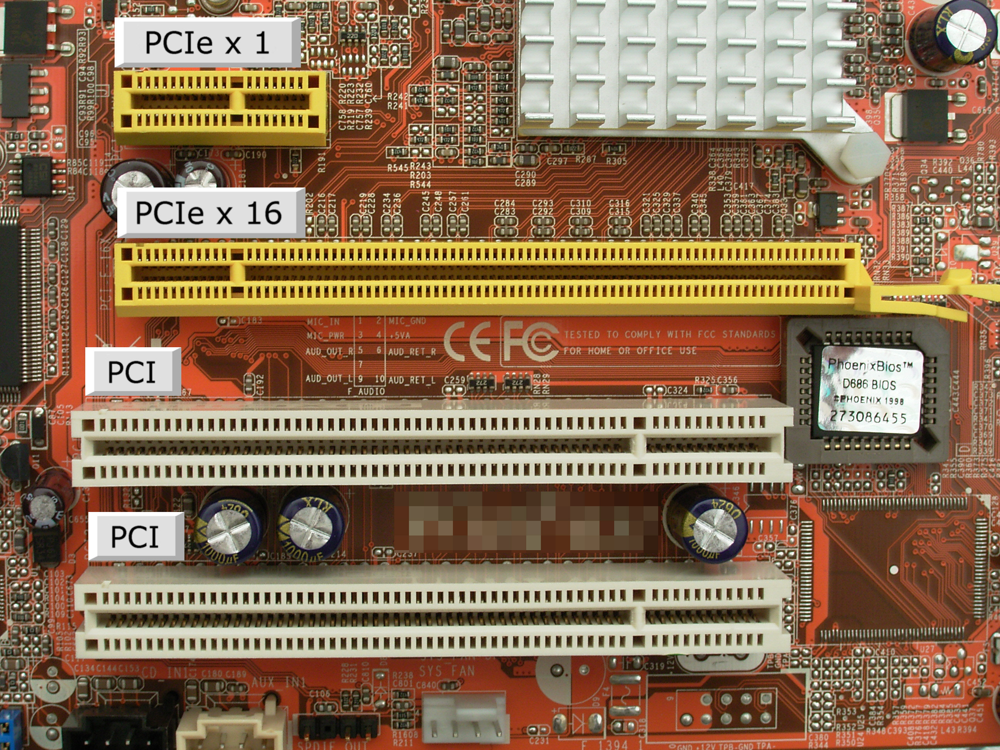
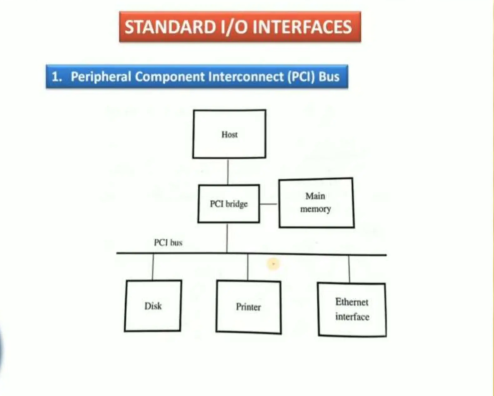

> Hi everyone I am [name], I am going to explain u OS related Commands.


# What is OS?
  So, before knowing OS related commands we should know what is OS. So,OS stands for operating system.
  It is system/application which starts when you start your Computer. It controls everything like                    CPU,GPU,keyboard,camera,application,memory.
  It is an interface between user, software and hardware.Even it is interface between ur software
  and hardware.

  ### Command to check what is ur OS?
      uname (linux)      --> unix name. macOS(darwin) , linux(linux)
      ver (windows)      --> version. Windows(Microsoft windows)

  
# Some important OS commands.

  ### lspci	(Hardware specific)
  	We will start with lspci which tells about devices connected to ur motherboard
		through pci bus.
    
    lspci—>lists peripheral component Interconnnect.
	     (shows infromation about connected device to ur motherboard like Network card,
            Graphic card,USB card etc.)


	pci Hardware level view -->


	
	 
	 
	 
	 lspci Diagram view -->


	  
	  
	  Execute `lspci` in terminal.	(ioreg -l )

	  Output—>

      00:00.0 Host bridge: Intel Corporation Device
			The host bridge is connection between CPU and PCI/PCIe devices
				bus.
	  
	  00:02.0 VGA compatible controller: Intel UHD Graphics
	  00:14.0 USB controller: Intel USB 3.0 eXtensible Host Controller
	  00:1f.6 Ethernet controller: Intel Ethernet Connection
	
  	00:00.0	--> PCI address simillar to port.

    00->Bus number.
    00-->Device number on bus.
    0-->Function number.It shows graphic function,audio function etc.

    Other commands is lscpu for cpu-connected devices information.It shows cpu architecture.
    (Not in macOS).


  ### uname
    It stands for unix name.It tells information about unix based OS 
	e.g. linux(unix type) ,dariwn,oracle solaris, netBSD.
	
	  uname --> Shows unix name.linux or darwin(macOs)    
	  uname -r —>for unix kernel version. e.g. 6.15.12
	  uname -m —> for CPU architecture.
    
					x86_32/64 architecture followed by intel processors.  (windows,old macs, no phones).
						x86 bcoz all chip names who r used inside it had last 2 numbers as 86.
					arm_64 architecture followed by silicon based processors.  (all phones,servers,new macs)
					
					arm for power efficiency so it uses less battery and heats less and bit slow.
					x86 for performance,it uses more batter and heat more.
					

	   uname -a —>tells everything about system,Its like using all above mentioned commands.

	   
  ### df
    df—>The df command stands for Disk Filesystem. It shows total disk space and disk usage.

    Common flags
    
    df	Show disk usage (in mac shared)
    df -h	Human-readable sizes, Mix of all(KB, MB, GB, TB). df -g for gb (df -BG in linux)
    df -H	Human-readable (uses powers of 1000 instead of 1024) e.g. 1000kb,1000mb,1000Gb
    df -T	Show filesystem type like ext4,xfs etc. It also adds column to report to show fs type.
    df -i	Show inode usage.It shows total number of files connected to total number of inodes.
			Each file is stored on 1 inode.To create a new file inode and disk both should be free.
			(default in macOs, always shows)
			
    df -a	Show all filesystems, including pseudo filesystems

  ### free
    free —> It tells RAM & swap memory usage.runs once and gives snapshot.
	  -h—> human readable
	  -m—>in MB
	  -g—>in GB
	  -m—>in mb
	  -k—>in Kb
	  --tera—> in tera
	  -s count —> refreshes table each second
				e.g. free -s 2 -c 5 (Every two seconds,do 5 times)
				e.g. free -s 2 (Every two seconds)

	Output--> (linux)
	
	total        used        free      shared  buff/cache   available
	Mem:         7982528     2456780     1023456      123456     4502292     5123456
	Swap:        2097148           0     2097148

	***Not in mac, In mac we use top or `sysctl -n hw.memsize`

  ### ps
    
    ps stands for Process Status. It is a Linux command used to display information about
	currently running processes.runs once and gives snapshot and exit.

  
    Q—>Why ps shows only some PID?
    Ans—>By default, ps shows only the processes started from your current terminal (TTY).
          Shows processes started by your current terminal, not other users terminals or system.

    --->How to check detailed process list of current terminal
      ans-->  ps -f

    Shows full format:

    UID   PID  PPID  C  STIME TTY CMD
    root  1    0     0  10:00 ?   systemd

    Extra columns:
    * UID → User who owns the process
    * PPID → Parent process ID
    * TTY—>terminal associated with it.
			TTY = ? , means process started by system,cron jobs,web server without any terminal.
	* C -> Number of CPU usage.


	 -->How to show all processes.
	   ans--> ps -e (or ps -A) shows all processes currently running on the system, regardless 
           of which terminal or user started them.
		   
		 Note -->  ps -a only shows processes associated with a terminal from system.Different than -A.


	 some useful commands-->
		ps -c appname --> shows pid of app (not in macOS) have to use pgrep -x appname
		ps -p pid --> shows only that process details. (not in macOS)


   	 --->Most commonly used

    ps aux (doesn't show parentID like -AF or -Ef)

    Shows all processes with detailed information even processes started without terminal.
	
	a--> all prcoesses.
	u--> show user information too.

	What is x in aux?
	Ans --> x shows processes started by system without any terminal when pc booted. 
			It shoes every process of system including daemon zombie.

	daemon process-->A daemon is a background process that provides a service to other 
						processes or application and usually runs continuously.
						It starts when the system boots (or when needed) and waits for work.
						It starts without terminal.
							e.g. sshd,httpd/nginx, cron job etc.
		  
    zombie process--> A process whose parent forget to collect its exit status.It doesn't uses cpu,
				ram,memory but only stays in log of OS. When parent collects its child exit
				status then only OS cleans the child from system.Simillar to when ur parents
				forgot to pick u from school in backdays.

			  These are harmless but, can polute the process table.Always a child process goes in
			  zombie mode.

			  z-status in output.

    `ps >> Practice/test.md`

	We can also store ps command output in some file to run scripts.

  ### top
    top—>It also shows process information.But, with resources usage like RAM,CPU etc and continious too.
				ps doesn't show resources usage, also ps runs once only.
          It runs continiously.Use `top -l 1` to get one snapshot.

    Execute top in terminal.

    output-->

    top - 10:30:01 up 2 days,  3:15,  2 users,  load average: 0.15, 0.10, 0.05
    Tasks: 220 total,   1 running, 219 sleeping
    %Cpu(s):  8.0 us, 2.0 sy, 90.0 id
    MiB Mem : 15920 total, 4200 used, 11720 free
    MiB Swap: 2048 total, 2048 free

     PID USER   PR NI  VIRT   RES   SHR S %CPU %MEM TIME+ COMMAND
     1234 root   20  0  500M   40M   10M S  5.2  0.3  0:12 nginx
     5678 user   20  0 1200M  200M   50M S 25.0  1.2  3:45 chrome

    Meaning of important fields
    top --> command name.
	10:30:01 --> current system time. o' clock.
    up	--> System uptime, 2 days and 3:15 hours.
    load average -->	CPU load over the last 1, 5, and 15 minutes
    Tasks -->	Number of running, sleeping, stopped, and zombie processes
    %Cpu(s) -->	CPU usage
    Mem	--> RAM usage
    Swap -->	Swap memory usage
    
    table
    Column	  Meaning
    PID	      Process ID
    USER	    Process owner
    PR	      Priority
    NI	      Nice value is User given priority value by nice command but, Linux decides process priority
                by itself using given nice value and PR shows CPUs decided priority value.
				
    VIRT	    Virtual memory used.Total RAM+swap memory allowed to use in future if required.
    
    RES	      Physical RAM used
    SHR	      Shared memory
    S	        Process state (R, S, D, T, Z)
    %CPU	    CPU usage
    %MEM	    RAM usage
    TIME+	    Total CPU time used
    COMMAND	    Process-name


	
    Common     flags

    top	Start live monitoring
    top -h	Show help (Linux)
    top -u <user>	Show processes for a specific user
    top -p <PID>	Monitor a specific process
    top -n <count>	Exit after a certain number of updates (Linux)
    top -b	Batch mode (useful for scripts) Not interactive, plain text output
			but continiously in terminal one after other.
			(top -b -n 1 for one snapshot and exit)
                          Not in Mac OS.In Mac we can use top -l 1 or top -l 1 > system_report.
                            txt to get one snapshot, we can also use “ps aux”command for 
								single snapshot.
								
     top -o %CPU	Sort by CPU usage (Linux)	for macOS remove % from %CPU.
     top -o %MEM	Sort by memory usage (Linux)
    
    Interactive keys (These doesn't work in macOS). We use above commands to sort or htop.
    While top is running:
    Key	Action
    q	Quit
    P	Sort by CPU usage
    M	Sort by memory usage
    k	Kill a process (top + kill together)Not supported in macOS. 
                          Install htop in Mac or find pid with top + grep then kill.
						  STEPS:
						  1.top then press k then write id in prompt then enter then write signalid then enter.
						  2.top then press k then highlight id then enter then enter.
						  
    h	Help
    1	Show CPU usage for each core (Linux)
    

  ### kill
      It is used to kill process.can be used alone or with top by pressing k in interactive mode.
	  top + k on interactive mode doesn't work in macOs,we use htop or get pid from top then kill.

    Syntax-->  kill pid or kill signal pid or kill signalname pid.
    	
      Number	  Signal	              Meaning	
      1	    SIGHUP (Hang Up)	      Terminal, Often tells a service to reload
                                     its configuration without closing.
	  
      3	    SIGQUIT (Quit)	     Stops the process and create a core dump for debugging eg-->.log file
	  
      6	    SIGABRT (Abort)	     Abort Process intentionally crashes itself, usually for debugging.
	  							  This command is used by process itself mostly.
								
      9	    SIGKILL (Kill)	     Force kill	Immediately terminates the process (cannot be ignored).
	  								Stops process without grace.
	  
     14	    SIGALRM (Alarm)	     Alarm timer expired Sent when a timer set by a process finishes.
                                  process sets alarm on OS that notify me after 10s or 5s.
								  Used for retry mechanism by process.
								
     15	  SIGTERM (Terminate)	 Normal termination Requests the process to close gracefully.Save and exit safely.

	Q-->Where we use these kill commands in real world?  
	
	Ans-->	We use these in backend e.g. ( webservers , microservices)

```python

import signal      # Lets the program receive OS signals like SIGTERM
import time        # Used for sleep()
import sys         # Used to exit the program

# This function will run automatically when SIGTERM is received

def shutdown(signum, frame):
    global running                     # Modify the global variable
    print("Received SIGTERM. Shutting down...")


	print("Closing files...")              # Close any open files here
	print("Closing database...")           # Close database connections here
	print("Exiting...")

	sys.exit(0)                            # Exit with success status code, it removes current
											 #running python file from system.

#---END OF FUnction defination


# Register the shutdown function in backend application using python.
signal.signal(signal.SIGTERM, shutdown)


# Main application loop
while True:
    print("Working...")                # Simulate doing some work
    time.sleep(1)                      # Wait for 1 second

#---END of main loop defination


```
	This will start and run normally until someone executes kill PID.


    


  

  
